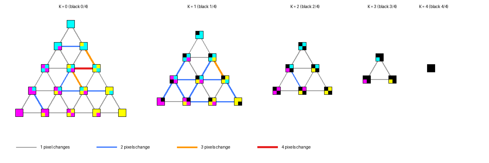

# The ink patterns: which 2×2 patterns, and why

Every cell of the arena, a *superpixel* of 2×2 MODE 1 pixels, is drawn in
one of four inks per pixel: cyan, magenta, yellow or black. This document
explains how we chose which of the possible patterns the game uses, the
graph of how painting moves between them, and the "minimum churn" objective
that shaped the choice.

The chosen table is `data/ink_patterns.json`. The solver that made it is
`tools/dontdither/solve_patterns.py`, and `tests/test_inks.py` checks every
property claimed here.

## 1. From 256 patterns to 35 states

A 2×2 cell with four inks per pixel has 4⁴ = **256** possible patterns.

The game doesn't care about arrangements, though, only about ownership:
how much of each ink a cell holds. Think of a cell as four *quanta*,
each owned by one ink. Its **ink state** is the count tuple (C, M, Y, K),
summing to 4.

There are **35** such states (the ways of splitting 4 among 4 inks:
C(7,3) = 35), and the 256 patterns fall into them like this:

| State type | Example | States | Arrangements each | Patterns |
|---|---|---|---|---|
| one ink (4) | (4,0,0,0) | 4 | 1 | 4 |
| 3+1 | (3,1,0,0) | 12 | 4 | 48 |
| 2+2 | (2,2,0,0) | 6 | 6 | 36 |
| 2+1+1 | (2,1,1,0) | 12 | 12 | 144 |
| 1+1+1+1 | (1,1,1,1) | 1 | 24 | 24 |
| | | **35** | | **256** |

**Each state has exactly one *canonical* pattern.** So the game uses 35 of
the 256 patterns, and the screen itself is the game state:
- to read a cell, look its pattern up in `pattern_to_state` (256
  entries; the other 221 patterns map to "not an ink"). Walls come from
  the level's wall map, not from reading the screen;
- to write a cell, draw its state's pattern.

One pattern per state also means one *texture* per ownership level. A
region where C owns three quarters always looks the same, however it got
there, and so the eye reads ownership directly. The alternative was to
let a cell keep whatever arrangement painting happened to produce. Painting
would then change fewer pixels, but equal ownership would look different
from place to place, and the arena would become visual noise.

## 2. The graph: painting moves one quantum

A shot doesn't *add* a pixel of the painter's ink, because the total is
always four. It **moves one quantum** from another ink to the painter's
ink: the painter's count goes up by one and a victim's goes down by one
(`paint.py`).

- **Nodes:** the 35 states.
- **Edges:** pairs of states that differ by one moved quantum: one count
  +1, another −1.

There are **120 edges**, and every hit on a cell traverses one of them.
Geometrically, the states are the points of a tetrahedron of side 4 in
four-ink space: its corners are the pure inks, and the (1,1,1,1) grey is
its centre. A state's degree (how many states one move reaches) depends on
its type:

| Type | Degree | Why |
|---|---|---|
| one ink | 3 | only it can give up a quantum, to any of 3 others |
| 3+1 | 6 | |
| 2+2 | 6 | |
| 2+1+1 | 9 | |
| 1+1+1+1 | 12 | any of 4 inks gives to any of the other 3 |

*The graph in slices by how much black a state holds: K = 0 on the left
(a triangle of C, M and Y mixtures, C at the top, M bottom left, Y bottom
right) down to K = 4, solid black, on the right. Each node shows the
state's actual canonical pattern. The figure draws the 60 edges within
slices, coloured by churn. The other 60 edges move a quantum to or from
black, joining neighbouring slices. Regenerate with `uv run
dd-preview-ink-graph`.*

## 3. Churn

An edge's **churn** is the number of pixels that differ between its two
states' canonical patterns (their Hamming distance): 1 to 4.

- A move of one quantum can always be *shown* by recolouring one pixel. So
  the ideal is churn 1 on every edge: each hit visibly changes one pixel,
  and the texture evolves smoothly.
- But each state has only one pattern, and it must serve all of its 3–12
  neighbours at once. So some edges must cost more.
- **Minimum churn** means choosing the 35 patterns to make those
  transitions as few and as small as possible.

## 4. The constraints and the objective

Choosing one of each state's arrangements is a combinatorial problem.
`solve_patterns.py` solves it exactly, with OR-tools' CP-SAT solver: a
boolean variable per candidate pattern, exactly one chosen per state, and
a churn indicator per edge.

**Hard constraints: how the textures must look.**

1. **Every 2+2 state is a checkerboard.** A 50:50 mixture then reads as an
   even blend. The other arrangement is two stripes, which reads as lines,
   and as different lines horizontally and vertically.
2. **In every 2+1+1 state the doubled ink lies on a diagonal.** Repeated
   across a region, the tile then forms a checkerboard of that ink rather
   than one-pixel stripes, for the same reason.
3. **Colour cycling equals rotation.** Relabelling the inks C→M→Y→K→C
   must give the same pattern as rotating the tile 90° clockwise, allowing
   for a one-pixel shift of the repeating texture. So each player's ink
   gets textures of equal character, and nobody's colour looks stripier
   or noisier than another's, which matters in a game about fairness.

   Exact equivalence, with no shift allowed, is impossible alongside
   checkerboards. Cycling twice swaps C with Y and fixes the state
   (2,0,2,0); two rotations are a half turn, which fixes a checkerboard. So
   the swapped checkerboard would have to equal itself, and it can't.

**Objective: minimum churn, lexicographically.** First the fewest edges
changing 4 pixels, then the fewest changing 3, then the fewest changing 2
(equivalently, the most changing only 1).

**The result was proved optimal:**

| Constraints | Churn 1 | 2 | 3 | 4 |
|---|---|---|---|---|
| none (pure minimum churn) | 84 | 36 | 0 | 0 |
| checkerboards and colour cycling, no diagonal rule | 78 | 36 | 6 | 0 |
| **all three (the game's table)** | **78** | **32** | **6** | **4** |

So the constraints cost some smoothness. The ten edges changing 3 or 4
pixels all touch a checkerboard state, or its neighbour (2,1,1,0), which
is exactly where rules 1 and 2 bite:

| Churn | From | Pattern | To | Pattern |
|---|---|---|---|---|
| 4 | (0,2,0,2) | KMMK | (0,2,1,1) | MKYM |
| 4 | (0,2,0,2) | KMMK | (1,2,0,1) | MCKM |
| 4 | (2,0,1,1) | KCCY | (2,0,2,0) | CYYC |
| 4 | (2,0,2,0) | CYYC | (2,1,1,0) | YCCM |
| 3 | (0,1,1,2) | KMYK | (0,2,1,1) | MKYM |
| 3 | (0,2,0,2) | KMMK | (0,3,0,1) | MKMM |
| 3 | (1,0,2,1) | KYYC | (2,0,1,1) | KCCY |
| 3 | (1,1,0,2) | KCMK | (1,2,0,1) | MCKM |
| 3 | (1,1,2,0) | CYYM | (2,1,1,0) | YCCM |
| 3 | (2,0,2,0) | CYYC | (3,0,1,0) | YCCC |

(Patterns are written row by row: top left, top right, bottom left,
bottom right.)

**Why we accepted that cost:** churn only affects how a cell's texture
jumps when it's painted. It costs the 6502 nothing: painting rewrites
both of the cell's half-bytes whatever changes. Coherent, fair textures
matter on every frame, so we preferred them.

## 5. The table

| Type | States (C,M,Y,K) and their patterns |
|---|---|
| one ink | (4,0,0,0) CCCC · (0,4,0,0) MMMM · (0,0,4,0) YYYY · (0,0,0,4) KKKK |
| 3+1 | (3,1,0,0) CCCM · (3,0,1,0) YCCC · (3,0,0,1) KCCC · (1,3,0,0) MCMM · (0,3,1,0) MMYM · (0,3,0,1) MKMM · (1,0,3,0) YYYC · (0,1,3,0) YYYM · (0,0,3,1) YYYK · (1,0,0,3) KKCK · (0,1,0,3) KKMK · (0,0,1,3) KKYK |
| 2+2 (checkerboards) | (2,2,0,0) MCCM · (2,0,2,0) CYYC · (2,0,0,2) KCCK · (0,2,2,0) MYYM · (0,2,0,2) KMMK · (0,0,2,2) KYYK |
| 2+1+1 (doubled ink on a diagonal) | (2,1,1,0) YCCM · (2,1,0,1) KCCM · (2,0,1,1) KCCY · (1,2,1,0) MCYM · (1,2,0,1) MCKM · (0,2,1,1) MKYM · (1,1,2,0) CYYM · (1,0,2,1) KYYC · (0,1,2,1) KYYM · (1,1,0,2) KCMK · (1,0,1,2) KCYK · (0,1,1,2) KMYK |
| 1+1+1+1 (the grey start) | (1,1,1,1) KCYM |

## 6. Where it lives

- **`data/ink_patterns.json`:** the table, the single source of truth.
- **`tools/dontdither/inks.py`:** the model: states, arrangements, the
  adjacency (`adjacent_state_pairs`), and the symmetries (`rotate_clockwise`,
  `cycle_inks`, `translations`).
- **`tools/dontdither/solve_patterns.py`:** the CP-SAT model. Re-solve with
  `uv run --group solver dd-solve-patterns`.
- **`tools/dontdither/gen_tables.py`:** generates the 6502's tables:
  `state_top_bytes`, `state_bottom_bytes` and the 256-entry
  `pattern_to_state`.
- **`tests/test_inks.py`:** asserts the hard constraints, the churn counts
  and the lookup tables.
- **History:** `docs/dont_dither_35_minimal_churn_patterns.md` and
  `docs/dont_dither_minimal_churn_gray_code.md` are the design's earlier
  proposals, including the unconstrained minimum-churn table (84/36/0/0),
  which this table supersedes.
